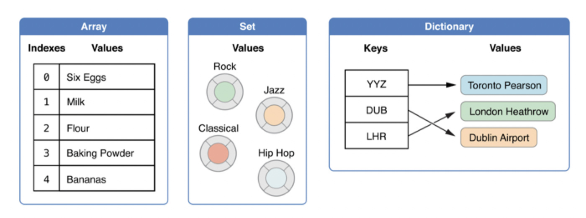

# playgrond 를 통한 기본 문법 연습 10 - Dictionary

## collection


- 특징 

  - 앱에서 데이터를 처리하기 위한 데이터 모음 방식 
  - 대표적인 3가지 방법
  - 
    - Array : ordered collections of values
    - Dictionary : unordered collections of key-value associations
    - Set : unordered collections of unique values

---

### Dictionary

- 특징
  
  - Element = Unique Key + Value ( 구분자 ":" )
  - Unordered Collection
  
- 딕셔너리 선언 방법

  - ```swift
    // 선언 방법
    let testArray: [String: Int]
    let testArray2: Dictionary<String, Int>
    let testArray1 = ["A":"Apple","B":"Banana","C":"car"]
    ```

- 딕셔너리 초기화 방법

  - ```swift
    let words1: Dictionary<String, String> = ["A": "Apple", "B": "Banana", "C": "City"]
    let words2: [String: String] = ["A": "Apple", "B": "Banana", "C": "City"]
    let words3 = ["A": "Apple", "B": "Banana", "C": "City"]
    ```

- 딕셔너리 갯수 구하기기

  - ```swift
    // 배열의 갯수 구하는 방법
    var words = ["A": "Apple", "B": "Banana", "C": "City"]
    let countOfWords = words.count												// 3
      
    // 딕셔너리가 비어있는지 확인
    if !words.isEmpty {
      print("\(countOfWords) element(s)")
    } else {
      print("empty dictionary")
    }
    ```
    
  
- 딕셔너리 내 인자 추출하기

  - ```swift
    let dict = ["A": "Apple", "B": "Banana", "C": "City"]
    // key 출력 방법
    for (key, value) in dict {
      print("\(key): \(value)")
    }
    
    for (key, _) in dict {
      print("Key :", key)
    }
    // value 출력 방법
    for (_, value) in dict {
      print("Value :", value)
    }
    
    for value in dict.values {
      print("Value :", value)
    }
    ```

- 딕셔너리 내 값 찾기

  - ```swift
    // 키와 벨류가 구분되어 있기 때문에 키를 찾는건지, 벨류를 찾는건지 컴파일러에게 정확하게 알려줘야 한다.
    for (key, _) in words {			//word에 인자가 2개 있기 때문에 (key, _) 두개를 받아줘야 한다.
      if key == "A" {
        print("contains A key.")
      }
    }
    
    //word에 인자가 2개 있기 때문에 (key, _) 두개를 받아줘야 한다. 
    if words.contains(where: { (key, value) -> Bool in // 클로져
      return key == "A"
      }) {
      print("contains A key.")
    }
    ```
  
- 딕셔너리 값 추가 

  - ```swift
    // 키가 동일한 경우 values 값이 변경된다. 딕셔너리의 특징
    words = ["A": "A"]
    
    words["A"]    // Key -> Unique
    
    words["A"] = "Apple"
    words									// ["A": "Apple"]
    
    words["B"] = "Banana"
    words									//["A": "Apple", "B": "Banana"]
    
    words["C"] = "City"
    words									//["C": "City", "A": "Apple", "B":"Banana"]
    ```

- 딕셔너리 값 변경

  - ```swift
    words = [:]
    words["A"] = "Application"
    words												// ["A": "Application"]
    
    words["A"] = "App"
    words												// ["A": "App"]
    
    // 키가 없으면 데이터 추가 후 nil 반환,
    // 키가 이미 있으면 데이터 업데이트 후 oldValue 반환
    
    if let oldValue = words.updateValue("Apple", forKey: "A") {
      print("\(oldValue) => \(words["A"]!)")											// "App => Apple\n"
    } else {
      print("Insert \(words["A"]!)")
    }
    words
    ```

- 딕셔너리 값 제거

  - ```swift
  // 키값으로 nil을 넣으면 value값이 삭제됨
    words = ["A": "Apple", "I": "IPhone", "S": "Steve Jobs", "T": "Timothy Cook"]
    words["S"] = nil
    words["Z"] = nil			// 없는 키에 접근에도 오류 안남 (배열이랑 다름)
    words									// ["T": "Timothy Cook", "I": "IPhone", "A": "Apple"]
    
    // 지우려는 키가 존재하면 데이터를 지운 후 지운 데이터 반환, 없으면 nil
    if let removedValue = words.removeValue(forKey: "T") {
      print("\(removedValue) removed!")				// "Timothy Cook removed!\n"
    }
    words																			// ["I": "IPhone", "A": "Apple"]
    words.removeAll()													// 전체 삭제
    ```


- 딕셔너리 중첩

  - ```swift
  var dict1 = [String: [String]]() // 딕셔너리 + 배열
    //dict1["arr"] = "A"
    
    dict1["arr1"] = ["A", "B", "C"]
    dict1["arr2"] = ["D", "E", "F"]
    dict1 // ["arr2": ["D", "E", "F"], "arr1": ["A", "B", "C"]]
    
    
    var dict2 = [String: [String: String]]() // 딕셔너리 + 딕셔너리
    dict2["user1"] = [
      "name": "나개발",
      "job": "iOS 개발자",
      "hobby": "코딩",
    ]
    dict2["user2"] = [
      "name": "나코딩",
      "job": "Android 개발자",
      "hobby": "코딩",
    ]
    dict2 
    // ["user2": ["hobby": "코딩", "job": "Android 개발자", "name": "나코딩"],
    //   "user1": ["name": "나개발", "job": "iOS 개발자", "hobby": "코딩"]]
    ```

