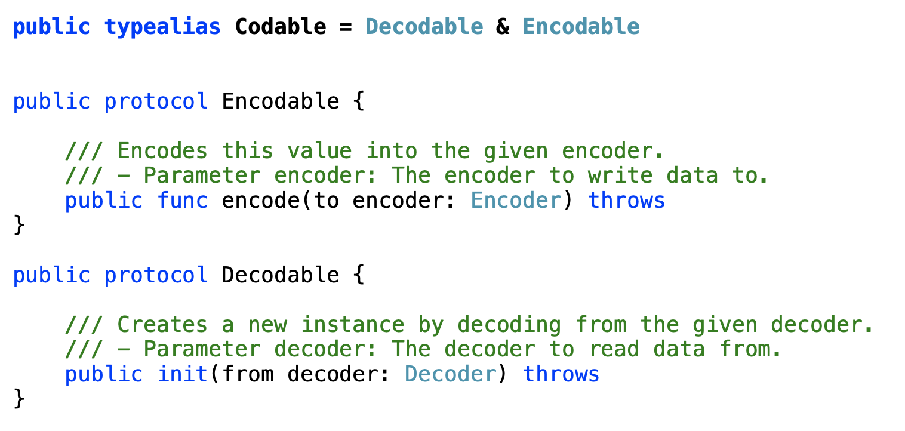
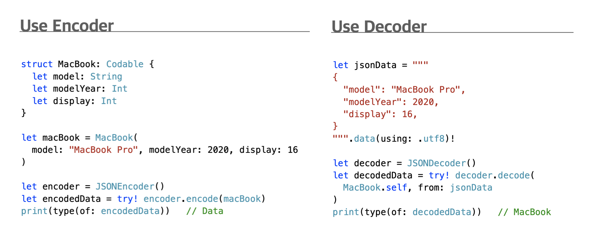
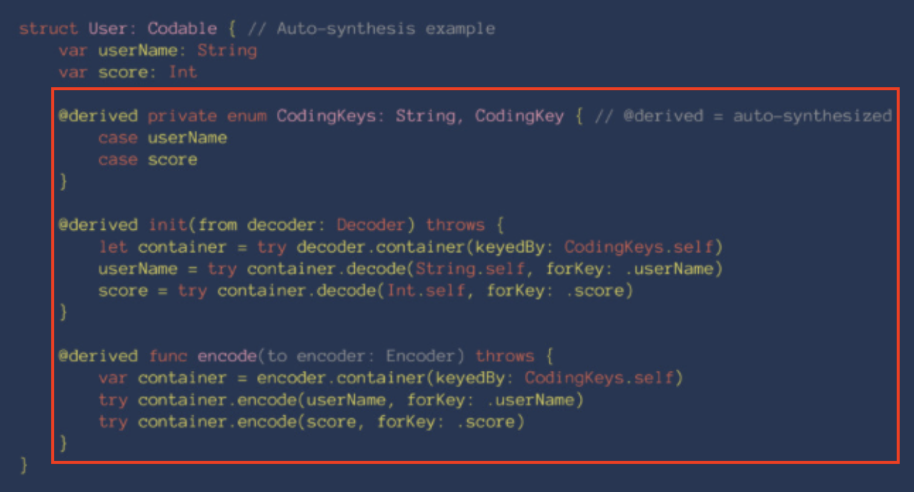
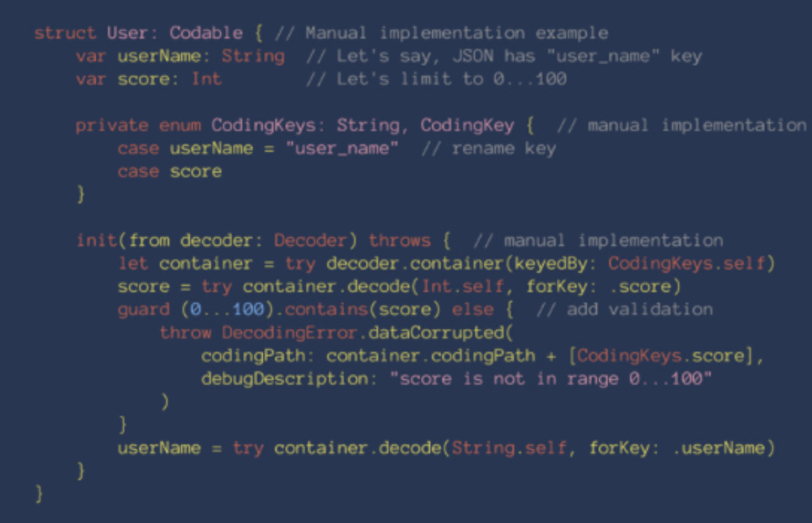

# Codable

- 데이터를  Swift에 맞게 변환하여 저장하고 네트워크로 보낼수 있도록 해주는 프로토콜
- 실제로는 Decodable & Encodable 로 되어있음
  - 
- Endcoding & Decoding
  1. Encoding, 부호화
     - 정보의 형태나 표준화, 보안, 처리 속도 향상, 저장 공간 절약 등을 위해서 목적에 맞는 다른 형태나 형식으로 변환하는 처리 혹은 그 처리 방식
     - Endocer: 인코딩을 수행하는 장치나 회로, 컴퓨터 소프트웨어, 알고리즘
  2. Decoding, 복호화
     - Encoding(부호화)된 대상을 원래의 형태로 되돌리는 일
     - 예들 들어, 압축을 다시 풀거나 암호화된 내용을 원래 내용으로 되돌리는 일



### 코드 생성

- 기본적으로 컴파일러가 자동으로 생성해준다
  - 사용자 생성 부분
    -  
  - .컴파일러가 자동으로 생성해주는 코드 예시
    - 
- 변수 네이밍이나 데이터가 중첩되어 전달되는 경우에는 사용자가 데이터에 맞게 별도로 코드를 작성해야 한다
  - 


### 소소코드 기본 예제

1. basic

   - ```swift
     struct Dog: Decodable {
       let age: Int
       let name: String
     }
     
     let jsonData = """
     {
       "age": 3,
       "name": "Tory"
     }
     """.data(using: .utf8)!
     
     let dog = try? JSONDecoder().decode(Dog,self, from: jsonData)
     print(dog)
     ```

2. Deocde Manually

   - ```swift
     struct Dog: Decodable {
       let age: Int
       let name: String
       
       private enum CodingKeys: String, CodingKey {
     		case age
     		case name
     	}
       
       init(from decoder: Decoder) throw {
         let values = try decoder.container(keyedBy: CodingKeys.self)
         age = try values.decode(Int.self, forkey:. age)
         name = try values.decode(String.self, forkey: .name)
       }
     }
     ```

3. Array

   - ```swift
     let jsonData = """
     [
       {
         "age": 3,
         "name": "Tory"
       }
     ]
     """.data(using:.utf8)!
     
     let dogs = try! JSONDecoder().decode([Dog].self, from: jsonData)
     print(dog)s
     ```

4. dictionary

   - ```swift
     let jsonData = """
     {
       "first": {
         "age": 3,
         "name": "Tory"
       },
       "second": {
         "age": 3,
         "name": "Tory"
       }
     }
     """.data(using: .uft8)!
     
     let decoder = JSONDecoder()
     let dogs = try! decoder.decode([String: Dog].self, from: jsonData)
     print(dogs)
     ```

5. Nested Keys

   - ```swift
     let jsonData = """
     [
     {
       "latitude": 30.0,
       "longitude": 40.0,
       "additionalInfo": {
         "elevation": 50.0,
       }
     },
     {
       "latitude": 60.0,
       "longitude": 120.0,
       "additionalInfo": {
         "elevation": 20.0
       }
     }
     ]
     """.data(using: .utf8)!
     
     
     struct Coordinate {
       var latitude: Double
       var longitude: Double
       var elevation: Double
     
       enum CodingKeys: String, CodingKey {
         case latitude
         case longitude
         case additionalInfo
       }
       enum AdditionalInfoKeys: String, CodingKey {
         case elevation
       }
     }
     
     
     extension Coordinate: Decodable {
       init(from decoder: Decoder) throws {
         let keyedContainer = try decoder.container(keyedBy: CodingKeys.self)
         latitude = try keyedContainer.decode(Double.self, forKey: .latitude)
         longitude = try keyedContainer.decode(Double.self, forKey: .longitude)
         
         let additionalInfo = try keyedContainer.nestedContainer(
           keyedBy: AdditionalInfoKeys.self,
           forKey: .additionalInfo
         )
         elevation = try additionalInfo.decode(Double.self, forKey: .elevation)
       }
     }
     ```

### Container Protocols

- KeyedContainer - 딕셔너리 타입의 데이터에 사용
- UnkeyedContainer -배열 타입의 데이터에 사용
- SingleValueContainer - 단일 값을 가진 데이터에 사용

### Reference

- 강의노트 :point_right: [링크](,,/LectureNode/Codable.pdf)
- 소스코드 :point_right: [링크](../SourceCode/200707_Codable)
- Apple
  - [Decodable](https://developer.apple.com/documentation/swift/decodable)
  - [Encodable](https://developer.apple.com/documentation/swift/encodable)


